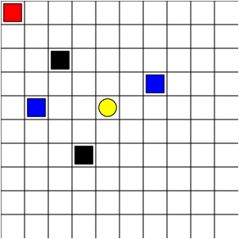
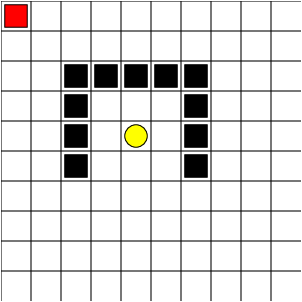

# Maze World - Assignment 4
Assignment code for course ECE 493 T25 at the University of Waterloo in Spring 2020.
(*Code designed and created by Sriram Ganapathi Subramanian and Mark Crowley, 2020*)

**Due Date:** Tuesday August 4 by 11:59pm submitted as PDF report to crowdmark and code to the LEARN dropbox. Please zip everything into one zip file during submission to Learn. 

**Collaboration:** You can discuss solutions and help to work out the code. But each person *must do their own work*. All code and writing will be cross-checked against each other and against internet databases for cheating. 

Updates to code which will be useful for all or bugs in the provided code will be updated on gitlab and announced.

## Domain Description - GridWorld
The domain consists of a 10x10 grid of cells. The agent being controlled is represented as a red square. The goal is a yellow oval and you receive a reward of 1 for reaching it, this ends and resets the episode.
Blue squares are **pits** which yield a penalty of -10 and end the episode. 
Black squares are **walls** which cannot be passed through. If the agent tries to walk into a wall they will remain in their current position and receive a penalty of -.3. Apart from these, the agent will receive a -0.1 for reaching any other cell in the grid as the objective is to move to the goal state as quickly as possible.
There are **three tasks** defined in `run_main.py` which can be commented out to try each. They include a combination of pillars, rooms, pits and obstacles. The aim is to learn a policy that maximizes expected reward and reaches the goal as quickly as possible.

# 

## Assignment Requirements

This assignment will have a written component and a programming component.
Clone the mazeworld environment locally and run the code looking at the implementation of the sample algorithm.
This assignment will expect you to train Deep RL algorithms. You need not implement these RL algorithms by hand. We suggest that you use the [stable baselines] (https://github.com/hill-a/stable-baselines) package. Feel free to play with the hyperparameters to arrive at the best one. In the report highlight the steps you tried to find the best hyperparameter for all the algorithms. 
- **(30%)** Implement DQN
- **(30%)** At least one other Deep RL algorithm of your choice or own design. 
- **(40%)** Report : Write a short report on the problem and the results of your two algorithms. The report should be submited on LEARN as a pdf. 
    - Describing each algorithm you used, define the states, actions, dynamics. Define the mathematical formulation of your algorithm, show the Bellman updates for your use.
    - Some quantitative analysis of the results, a default plot for comparing all algorithms is given. You can do more than that.
    - Clearly mention the hyperparameters used and the steps that you took to arrive at this value. 
    - Some qualitative analysis of why one algorithm works well in each case, what you noticed along the way.
    - Compare the Deep Learning algorithms with atleast two algorithms implemented in the previous assignments both quantitatively and qualitatively. 

You need a version of python that is > 3.5 and < 3.8 installed in your machine for stable baselines. If you have other versions installed, you can have parallel installations, but use the python between 3.5 and 3.8.   

Note that tensorflow < 1.15 (install using command like pip3 install tensorflow==1.15) is needed for stable baselines as it does not support tensorflow 2.0 yet. See the installation instructions here, [stable baselines] (https://stable-baselines.readthedocs.io/en/master/guide/install.html). 

Note: Stable baselines is just a suggestion. There are other RL packages out with different deep learning libraries that can also be tried. 

### Evaluation
You will also submit your code to LEARN and grading will be carried out using a combination of automated and manual grading.
For this assignment, your algorithms need not follow the pattern of the `RL_brain.py` and `RL_brainsample_PI.py` files.
We will look at your definition and implmentation which should match the description in the document.
We will also automatically run your code on the given domain on the three tasks defined in `run_main.py` as well as other maps you have not seen in order to evaluate it. 
Part of your grade will come from the overall performance of your algorithm on each domain.
So make sure your code runs with the given unmodified `maze_env` code if we import your class names. Note that any changes can be done to the `run_main.py` except changing the definition of the tasks given to you. You can submit more than one `run_main.py` files (like one for each algorithm). 

### Code Suggestions
- When the number of episodes ends a plot is displayed of the algorithm performance. If multiple algorithms are run at once then they will be all plotted together for comparison. You may modify the plotting code and add any other analysis you need, this is only a starting point.
- there are a number of parameters defined in `run_main` that can be used to speed up the simulations. Once you have debugged an algorithm and see it is running you can alter the `sim_speed`, `\*EveryNth` variables to alter the speed of each step and how often data is printed or updated visually to speed up training. 
- For the default algorithms we have implmented on these domains it seems to take at least 1500 episodes to converge, so don't read too much into how it looks after a few hundred.

